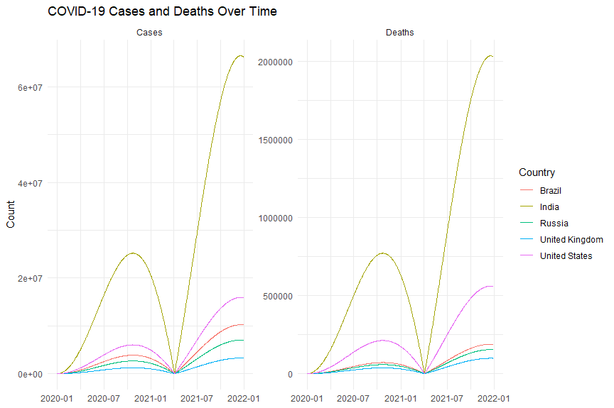
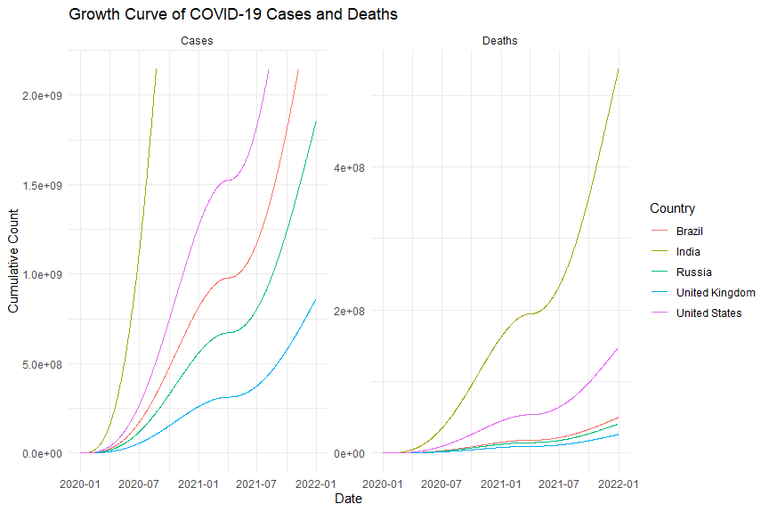
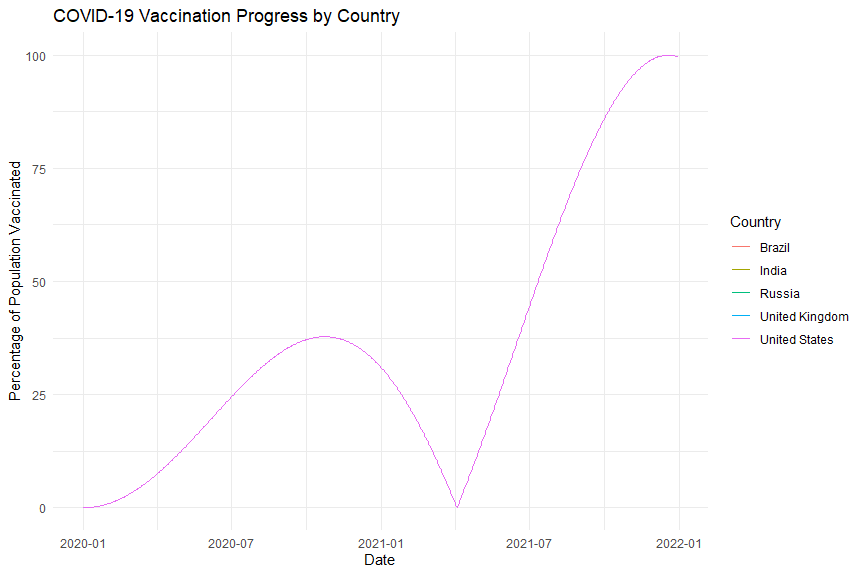
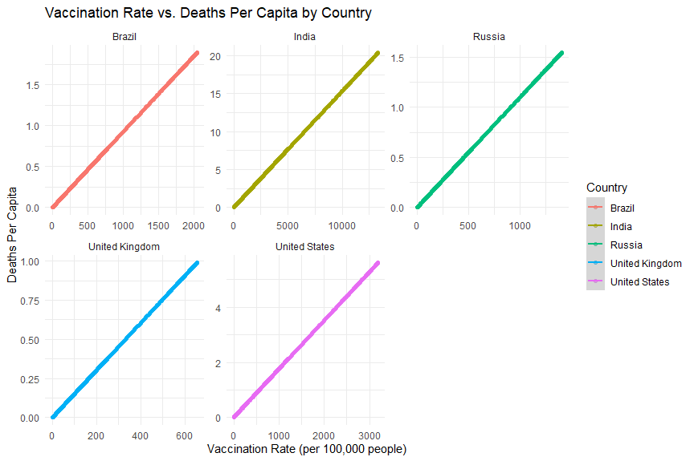

# COVID-19 Data Analysis Repository

This repository is dedicated to advanced data analysis and visualization of the COVID-19 pandemic, utilizing a synthetic dataset that reflects realistic trends in cases, deaths, and vaccination rates across five countries. The repository contains scripts in multiple programming languages, including R, Python, Julia, SAS, and Stata, each designed to explore different aspects of the COVID-19 data.

## Dataset Overview

The dataset, `synthetic_covid_data_realistic.csv`, comprises simulated daily data on COVID-19 cases, deaths, recovered cases, and vaccination rates for the United States, Brazil, India, Russia, and the United Kingdom from January 1, 2020, to December 31, 2021. The dataset was generated to mimic real-world dynamics and provide a basis for comprehensive data analysis and visualization exercises across various programming languages.

### covid19DataGetter.py

The `covid19DataGetter.py` Python script is responsible for getting the synthetic COVID-19 dataset from public health sources.

## R Scripts

### Advanced R Analysis

1. **CovidTrendAnalysis.R**: This script performs a time-series analysis, plotting the trends of COVID-19 cases and deaths over time for each country.

2. **VaccinationImpactAnalysis.R**: This script investigates the impact of vaccination rates on COVID-19 cases and deaths, employing various statistical methods to infer correlations.

### Plot Images

## Python Scripts

1. **CovidTrendAnalysisPython.py**: Analyzes COVID-19 case and death trends using Pandas for data manipulation and Matplotlib/Seaborn for plotting.

2. **VaccinationImpactAnalysisPython.py**: Explores the relationship between vaccination rates and case/death rates per capita.

## Julia Script

**CovidVisualizationJulia.jl**: Utilizes the Plots.jl package to create comparative plots of cumulative cases over time and a heatmap of vaccination rates.

## SAS Script

**CovidTrendAnalysisSAS.sas**: Generates time series plots for COVID-19 deaths and vaccination rates, highlighting the capabilities of SAS for data visualization.

## Stata Script

**CovidTrendAnalysisStata.do**: Focuses on visualizing COVID-19 trends in cases and deaths over time, demonstrating Stata's graphing functionalities.

**VaccinationImpactAnalysisStata.do**: Analyzes the effect of vaccination on controlling the pandemic through scatter plots.

## Getting Started

To use the scripts in this repository:

1. Download the `synthetic_covid_data_realistic.csv` dataset from this GitHub repository.
2. Choose the script corresponding to the programming language and analysis you are interested in.
3. Ensure you have the necessary environment and libraries/packages installed for the selected programming language.
4. Run the script in your preferred development environment or command line interface.

## Contributing

Contributions to enhance the analysis, add new scripts, or improve data visualization are welcome. Please feel free to fork the repository, make your changes, and submit a pull request.

## License

This project is open-source and available under the MIT License.

## Acknowledgements

This project is for educational purposes only. All analyses and conclusions should be considered illustrative.

Also, note that the dataset that we are getting is changing as it is being updated, so keep in mind that our plots may change as well.

---

Created with ❤️ by [Son Nguyen](https://github.com/hoangsonww) in 2024.